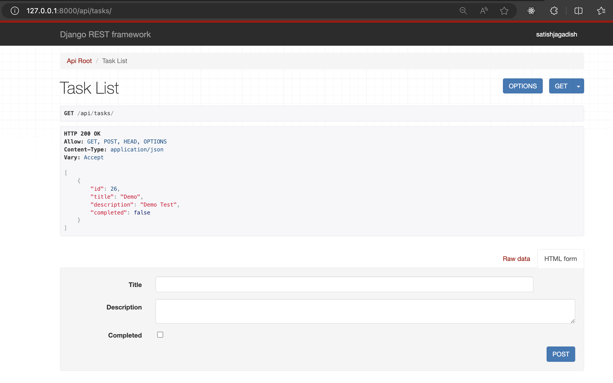
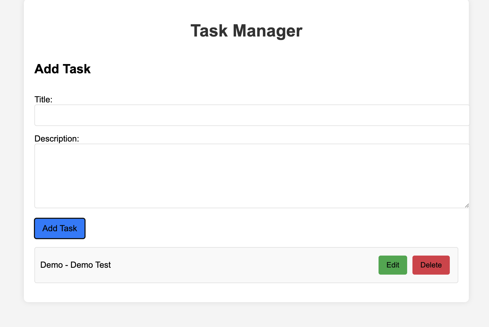

# Simple Website Task Manager
Author: Satish Jagadish
Date: August 21, 2024
## Overview

This project is a simple Task Manager web application built with a React frontend and a Django backend. It allows users to create, edit, and delete tasks. The application is designed to be easily extendable and can be used as a starting point for more complex projects.

## Table of Contents

- [Overview](#overview)
- [Features](#features)
- [Technologies Used](#technologies-used)
- [Prerequisites](#prerequisites)
- [Installation](#installation)
- [Running the Project](#running-the-project)
- [API Endpoints](#api-endpoints)


## Features

- Add new tasks with a title and description
- Edit existing tasks
- Delete tasks
- Automatically switches between add and edit modes
- Clear input fields after saving tasks

## Technologies Used

- **Frontend:** React.js
- **Backend:** Django (Python)
- **API Client:** Axios
- **Styling:** CSS

## Prerequisites

Before you begin, ensure you have met the following requirements:

- Node.js and npm installed on your machine
- Python and pip installed on your machine
- Virtual environment tool (like `venv`) installed

## Installation

### 1. Clone the repository

```bash
git clone https://github.com/Satish740/Task_Management.git
cd Task_Management

```
### 2. Set up the Backend
Create a virtual environment:
```bash
python3 -m venv venv
source venv/bin/activate
```
Install the required Python packages and Navigate to the backend directory and c:
```bash

pip install -r requirements.txt
cd backend
```
Apply the migrations:

```bash

python manage.py migrate
```
Create a superuser to access the Django admin panel:

```bash

python manage.py createsuperuser
```
### 3. Set up the Frontend
Navigate to the frontend directory and install the npm packages:
```bash

cd frontend
npm install
```
### 4. Configure Proxy (Optional)
If you want the frontend to communicate with the backend, make sure the proxy is set in the frontend/package.json file:
```json

"proxy": "http://127.0.0.1:8000"
```
## Running the Project
### 1. Start the Project Using concurrently
You can start both the frontend and backend servers concurrently by running:

```bash

npm start
```
This command will start the frontend development server and the backend server at the same time.

### 2. Start the Backend Server Manually (If Needed)
Make sure the virtual environment is activated and then run:

```bash

cd backend
source venv/bin/activate
python manage.py runserver 127.0.0.1:8000
```


### 3. Start the Frontend Development Server Manually (If Needed)
In another terminal window, navigate to the frontend directory and run:

```bash
cd frontend
npm start
```


### 4. Access the Application

The application should be running at http://localhost:3000.
## API Endpoints
GET /api/tasks/: List all tasks
POST /api/tasks/: Create a new task
PUT /api/tasks/id: Update an existing task
DELETE /api/tasks/id: Delete a task

